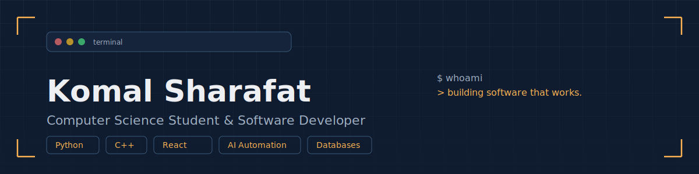
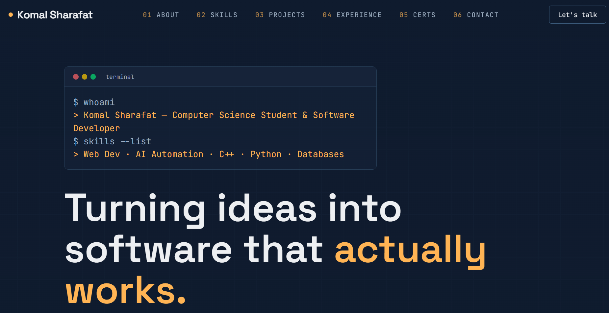
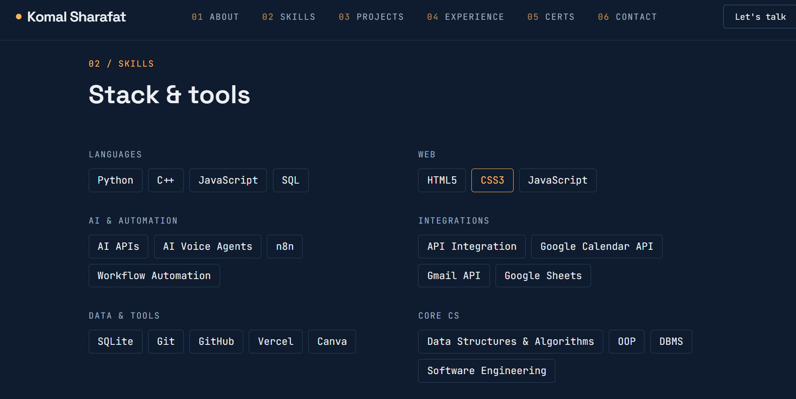
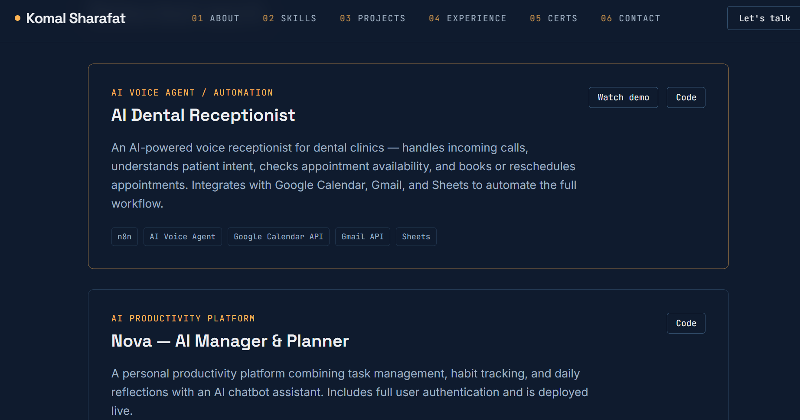
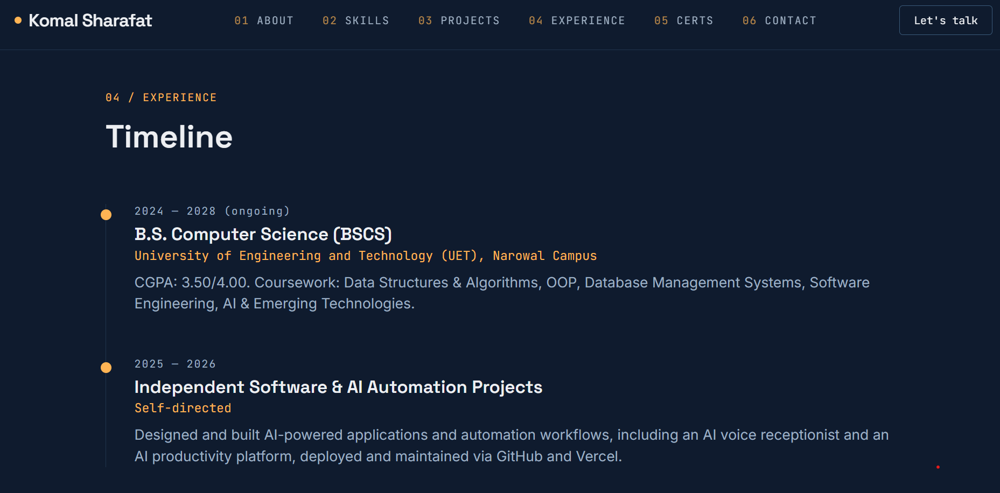
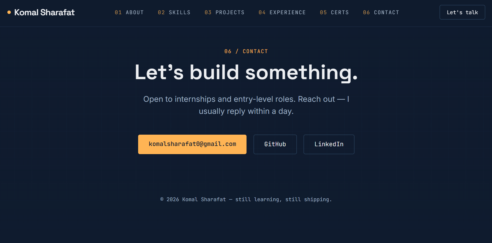

<p align="center">
  
</p>

# 👋 Hi, I'm Komal Sharafat

### 💻 Computer Science Student | 🤖 AI & Automation Enthusiast | 🚀 Software Developer

Welcome to my personal portfolio repository! This project showcases my journey as a Computer Science student, my technical skills, and the projects I've built while exploring **software development, AI, and automation**.

I enjoy turning ideas into practical applications, learning new technologies, and building solutions that solve real-world problems.

---

## 🌐 Explore My Portfolio

### 🚀 [Visit My Live Portfolio](YOUR_VERCEL_URL)

Explore my projects, skills, experience, and more through my personal portfolio website.

<p align="center">
  
</p>

---

## 👩‍💻 About Me

I'm currently pursuing a **Bachelor of Science in Computer Science (BSCS)** and continuously developing my skills through academic work, personal projects, and hands-on learning.

My areas of interest include:

* 🤖 Artificial Intelligence & AI Automation
* ⚙️ Workflow Automation
* 💻 Software Development
* 🌐 Web Development
* 🔗 API Integration
* 🗄️ Database Management
* 🧩 Data Structures & Algorithms

I'm passionate about learning, building, and continuously improving as a developer.

<p align="center">
  
</p>

---

## 🛠️ Tech Stack

### 💻 Programming Languages


### 🌐 Web Development


### 🤖 AI & Automation


**Areas of Experience:**

* 🤖 AI Agents
* ⚙️ Workflow Automation
* 🧠 AI-powered Applications
* 🔗 API Integration

### 🗄️ Databases


### 🧰 Tools & Platforms


---

# 🚀 Featured Projects

<p align="center">
  
</p>

---

## 🤖 AI Dental Receptionist Agent

An AI-powered virtual receptionist designed to help dental clinics automate front-desk tasks and appointment management.

### ✨ Highlights

* 📞 AI-powered call handling
* 🧠 Understands patient intent
* 👤 Collects patient information
* 📅 Checks appointment availability
* 🗓️ Books appointments through Google Calendar
* 📧 Sends automated confirmation emails
* 🔔 Notifies clinic staff about booking changes
* 📊 Logs booking information in Google Sheets
* ⚙️ Automates workflows using n8n

### 🛠️ Tech Stack

`n8n` `Vapi` `AI` `Google Calendar API` `Gmail` `Google Sheets`

🔗 **[View Project on GitHub](https://github.com/Komal-Sharafat-518/AI-Dental-Receptionist-Agent)**

---

## 🧠 Nova — AI Manager & Planner

Nova is an AI-powered productivity application designed to help users organize their tasks, habits, reflections, and daily activities.

### ✨ Highlights

* ✅ Task management
* 📋 Daily planning
* 🌅 Morning reflections
* 🌙 End-of-day reflections
* 🌱 Habit tracking
* 🤖 AI chatbot powered by API integration
* 🔐 User authentication
* 📊 Personal productivity management

### 🛠️ Tech Stack

`JavaScript` `OpenWeather API` `Grok API` `HTML` `CSS`

🔗 **[View Project on GitHub](https://github.com/Komal-Sharafat-518/NOVA)**

---

## 🎮 AlgoEscape — Algorithm Learning Game

AlgoEscape is an interactive educational game designed to make learning **Data Structures and Algorithms** more engaging and enjoyable.

The project combines algorithmic concepts with an interactive game experience to encourage learning through problem-solving and challenges.

### ✨ Highlights

* 🧩 Interactive algorithm challenges
* 🧠 Data Structures & Algorithms learning
* 🎯 Problem-solving focused gameplay
* 📚 Educational and interactive experience
* 🚀 Designed to make algorithm learning more engaging

### 🛠️ Tech Stack

`C++`

🔗 **[View Project on GitHub](https://github.com/Komal-Sharafat-518/AlgoEscape-DSA-Game)**

---

## 🏨 Hostel Management System

A database-driven management system designed to organize and simplify hostel administration and student record management.

### ✨ Highlights

* 👨‍🎓 Student record management
* 🏠 Hostel and room management
* 📋 Organized student information
* 🔍 Easy access to records
* 🗄️ Database management
* ⚙️ Simplified hostel administration

### 🛠️ Tech Stack

`C++`

🔗 **[View Project on GitHub](https://github.com/Komal-Sharafat-518/Hostel-Management-System)**

---

# 🎓 Education

### Bachelor of Science in Computer Science (BSCS)

**UET Narowal**

Currently building knowledge and practical experience in:

`Data Structures & Algorithms` · `Database Management Systems` · `Software Engineering` · `Computer Networks` · `Web Development` · `Object-Oriented Programming` · `Operating Systems`

<p align="center">
  
</p>

---

# 🌱 Currently Exploring

```text
🤖 Artificial Intelligence & AI Agents
⚙️ AI Automation & Workflow Automation
🌐 Web & Software Development
🔗 APIs & Third-Party Integrations
🧠 Data Structures & Algorithms
☁️ Cloud Deployment & Modern Development Tools
```

---

# 📈 My Development Journey

I believe in learning by building.

Throughout my journey, I have independently designed and developed projects ranging from academic database and algorithm-based systems to modern web applications and AI-powered automation solutions.

Each project has helped me strengthen my problem-solving skills, explore new technologies, and gain practical experience in software development.

I'm continuously expanding my technical knowledge and exploring new ways to use technology to solve practical problems.

---

# 🤝 Let's Connect

I'm always open to connecting with **developers, recruiters, clients, and technology enthusiasts** interested in software development, AI, and automation.

<p align="center">
  
</p>

### 💼 LinkedIn

[Connect with me on LinkedIn](https://www.linkedin.com/in/komal-sharafat-93697538b)

### 🐙 GitHub

[Explore my GitHub](https://github.com/Komal-Sharafat-518)

### 🌐 Portfolio

[Visit my Portfolio](YOUR_VERCEL_URL)

### 📧 Email

[komalsharfat0@gmail.com](mailto:komalsharfat0@gmail.com)

---

## ⭐ Thanks for Visiting!

Thank you for taking the time to explore my portfolio and projects.

If you find any of my projects interesting, feel free to ⭐ the repository or connect with me!

### Built with ❤️ and curiosity by **Komal Sharafat**
